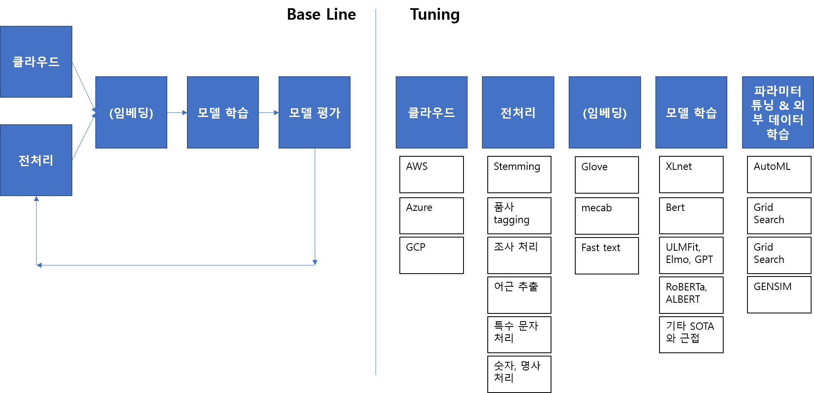

# 2019-12-17

## Done

- 공모전에 관한 진행 일정 수립

  

- 업무환경 설정

  **trello가 가장 main이 되는 앱이고, 공지사항도 거기에 업로드 합니다.**

  - slack: 메신저, 자동화 기능. 카톡과 차별화 되는 점은 자동화 기능
  - trello: 일정관리 및 업무 공유
  - gdrive: 파일 공유
  - git: 코드 공유 및 문서 정리

## Done - Detail

- 공모전에 관한 진행 일정 수립
  - Base Line까지는 역할을 나눠서 하는게 아니라 전체적으로 다 같이 하는 것이 좋겠습니다. 왜냐하면, 지식을 공유해서 알고 있는 부분을 공유해야 나중에 튜닝을 할 때, 각자가 수월하게 튜닝을 할 수 있겠습니다.
  - Base Line 이후 부터는 각자 역할을 나누거나, 튜닝을 어떻게 할지 각각 다르게 잡아서 시도를 여러번 해서 가장 좋은 모델을 선정해서 제출하면 되겠습니다.
  - **Base Line**을 만드는 **마감 기한**은 **이번 주 일요일(12. 22)**까지로 정했습니다.
- 업무환경 설정
  - 모든 내용은 trello를 중심으로 연결될 것입니다. 따라서 trello를 잘 보는 것이 중요합니다.
  - slack은 카카오톡과 다르게 `자동화`에 관한 부분이 있습니다. 예를 들어, Base Line이 만들어진 이후에 파라미터(모델의 Depth, Width 등)을 바꿔가면서 학습을 한다고 했을 때, `클라우드 구축, 운영체제 설치, 환경 세팅, 파라미터 설정, 훈련 모델 실행` 등을 봇을 만들어서 명령어 하나로 자동화 할 수 있습니다.

## TODO

일일 과제: 전처리에 대해서 각자 조사하기

