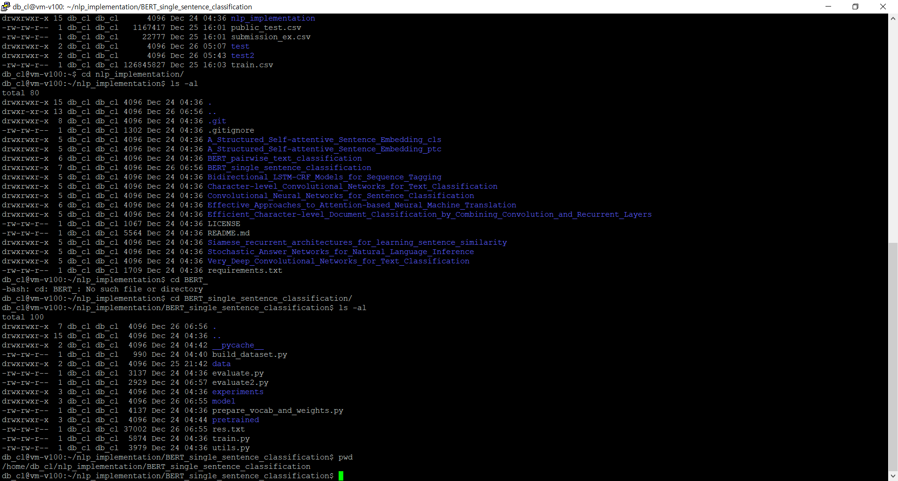

# SKT brain BERT 실행하기


본 문서는 https://github.com/aisolab/nlp_implementation.git의 `BERT_single_sentence_classification`을 우리의 데이터(문자 스미싱)로 실행하는 튜토리얼입니다.


1. 환경구성
   - OS: ubuntu 18.04 LTS
   - gpu: K80 or V100(간단한 테스트는 K80에서 하고, 실제 동작은 V100에서 합니다.)
2. https://github.com/aisolab/nlp_implementation.git 깃을 clone 합니다.
3. 데이터를 준비해서 복사하고, 아래의 지시사항을 따릅니다.





## 수정한 파일들

- data/my_train.txt (추가)
- data/my_test.txt (추가)
- build_dataset.py (수정)
- evaluate2.py (추가)
- model/metric2.py (추가)


### train, test 파일 준비

```python
# transfile.py
import pandas as pd
df_train = pd.read_csv('train.csv') # 훈련데이터를 읽어옵니다.
df_new_train = pd.DataFrame()
df_new_train['document'] = df_train.text
df_new_train['label'] = df_train.smishing
df_new_train.to_csv('my_train.txt', index=False, sep='\t')

df_test = pd.read_csv('public_test.csv') # 테스트데이터를 읽어옵니다.
df_new_test = pd.DataFrame()
df_new_test['document'] = df_test.text
df_new_test.to_csv('my_test.txt', index=False, sep='\t')
```


### data/my_train.txt

```
document        label
행성 산 팀장 입니다 행복 한 주말 되 세요        0
오늘 도 많이 웃 으시 하루 시작 하 세요 은행 진월동 VIP 라운지 올림      0
안녕 하 십니까 고객 님 은행 입니다 금일 납부 하 셔야 할 금액 153600 원 입니다 감사 합니다 새해 복 많이 받 으십시오 은행 옥포 올림       0
고객 님 안녕 하 세요 은행 지점 입니다 지난 한 해 동안 저희 지점 에 보내 주 신 성원 에 감사 드립니다 설렘 으로 시작 한 2017 년 소망 하 시 일 모두 고객 님 의 가정 에 늘 건강 과 행복 함께 하 길 기원 하 겠 습니다 사랑 하 가족 과 함께 정 나누 행복 한 설 명절 보내 세요 은행 지점 직원 일동 0
1 월 새로움 가득 입니다 올 한 해 더 많이 행복 한 한 해 되 시 길 바랍니다        0
행복 한 주말 보내 세요 용 현남 전담 직원 대리 올림      0
고객 님 안녕 하 세요 은행 무교 지점 과장 입니다 오늘 아침 에 눈 뜨 니 눈 많이 와서 온 세상 하얗 게 변했 더군요 어릴 적 에 눈 마냥 좋 기 만 했 는데 눈 보 순간 좋 기 보다 먼저 출근 걱정 하 게 되 더라구요 이제 진정 한 어른 되 었 음 느끼 게 됩니다 새해 인사 드리 기 전 에 제 발령 나 서 본점 으로 게 되 었 어요 ㅠㅠ 진정한 구정 새해 인사 보다 이별 인사 먼저 드리 게 되 어 송구 할 뿐 입니다 그 동안 보내 주 신 성원 에 감사 또 감사 드리 며 은행 에 있 고객 님 평생 저 의 고객 으로 모시 겠 습니다 새해 복 많이 받 으시 고 2017 년 원 하 고 바라 시 모든 일 이루 시 길 기원 합니다 은행 무교 지점 과장 올림       0
고객 님 지난 한 해 베풀 어 주 신 은혜 진심 으로 감사 드립니다 가슴 깊이 간직 하 겠 습니다 정유 년 새해 가족 모두 행복 하 시 고 뜻 하 바 모두 이루 시 길 진심 으로 소망 합니다 은행 지점장 정 배상    0
설 연휴 가족 들 과 훈훈 한 정 나누 시 고 정겨운 추억 많이 만드세요 오 올림      0


...

(이하 생략)
```

위의 파일은 `tab`기호로구분되어 있습니다.


### data/my_test.txt

```
document
고객 님 안녕 하 세요 새롭 게 시작 하 한 주 행복 가득 하 시 길 기원 합니다 지난주 글로벌 증시 파월 미 연준 의장 통화 정책 에 대해 완화 적 인 태도 변화 보인 것 주초 투자 심리 개선 으로 이어지 며 큰 폭 상승 마감 했 습니다 더불 어 미 중 차관 급 무역 협상 순조 롭 게 진행 된 점 도 긍정 적 었 습니다 원 달러 환율 주간 7 5 원 으로 하락 하 가운데 외국인 투자자 의 국내 증시 순 매수 규모 8 천억 상회 하 며 수급 개선 된 점 도 주목 해 볼 필요 있 습니다 금주 시장 미국 금융 주 실적 발표 시작 으로 본격 적 인 실적 시즌 에 진입 하 게 됩니다 지난주 애플 삼성전자 등 주요 기업 들 의 1 분기 실적 전망 하향 조정 있 었 던 점 참고 한다면 올해 글로벌 성장 둔화 기조 속 에서 기업 들 의 순익 감소 추이 관심 있 게 살펴보 실 필요 있 어 보 입니다 주 후반 에 브렉 시트 영국 하원 표결 예정 되 어 있 습니다 추워진 날씨 에 건강 유의 하 시 고 좋 한 주 되 세요 감사 합니다 은행 송도 센터 올림
긴급 안내 은행 가락동 지점 헬리오 기본 대출 이자 조합 에서 납부 했었으나 2018 년 12 월 25 일부 로 종료 되 었 습니다 따라서 2019 년 1 월 25 일 부터 매월 25 일 중도금 대출 이자 계약자 님 께서 직접 납부 하 셔야 됩니다 방법 안내 1 자동 체 등록 은행 영업 점 본인 방문 신분증 지참 직원 에게 대출 계좌 대출 자 자동 납부 로 계좌 간 자동 체 등록 요청 인터넷 뱅킹 공인 인 증서 로그인 후 자동 체 등록 2 자동 체 미 등록 고객 2019 1 25 일 까지 가까운 은행 영업 점 방문 하 여 대출 자 납부 3 대출 이자 매월 25 일 직접 납부 하 셔야 되 사항 으로 자동 체 등록 간곡히 권장 합니다 4 매월 25 일 대출 자 미납 시 대출 부분 에 대하 여 연체 자 및 신용 상 의 불 이익 발생 될 수 있 사오니 점 꼭 유의 하 시 길 바랍니다 5 현재 기본 대출 보유 하 고 고객 님 께 만 해당 되 사항 입니다 6 자동 체신 청 이미 등록 고객 님 해당 사항 없 습니다 7 감사 합니다
고객 님 안녕 하 세요 올해 미세먼지 유난 인 거 같 습니다 엊그제 새해 시작 된 거 같 든데 벌써 설 명절 가까워졌 습니다 감사 의 마음 으로 명절 보내 드렸 습니다 주말 까지 못 받 으시 면 연락 주 세요 늘 건강 하 시 고 행복 하 세요 은행 올림
고객 님 찾아온 행운 잡 으셨 나요 못 잡 으셨다면 이번 에 다시 잡 으시 길 기원 합니다 기쁜 날 기원 하 은행 내당동 종합 금융 센터 팀장 팀원 올림
고객 님 새해 복 많이 받 으세요 은행 코스트코 퇴직 연금 담당자 입니다 고객 님 의 소중 한 퇴직 연금 지속 적 으로 거래 해 주 셔서 너무 감사 드립니다 다름 아니 라 1 월 1617 일 오전 10 시 오후 2 시 까지 코스트코 중층 상담 부 고객 님 의 퇴직 연금 상담 예정 입니다 신분증 지참 하 여 찾 아 주 시 면 퇴직 연금 상품 외 은행 거래 에 대한 자세 한 상담 도 함께 받 으실 수 있 습니다 참고 로 대구 혁신 지점 로 옮기 신 분 가까운 행대 구혁 신 지점 에서 상담 지원 예정 입니다 감사 합니다 행복 현동 지점 팀장 올림
기기 분 좋 게 해해 피하 게 년 년 중 내내 1 월 의 바램 과 소원 쭈욱 겨울 의 꽃 1 월 행복 으로 마감 되 눈 보 고 눈 웃 신나 하루 되 세요 양 올림
고객 님 안녕 하 세요 은행 지점 VIP 팀장 입니다 제 이번 에 심사 역 과정 연수 게 되 었 습니다 항상 저희 지점 아껴 주 셔서 감사 드리 고 새로운 VIP 팀장 이용 하 시 는데 전혀 불편 함 없 도록 조치 해 놓 겠 습니다 직접 찾 아 뵙 고 인사 올려야 마땅 하 지만 이렇게 메시지 통해 인사 드리 게 된 점 양해 해 주 시 기 바 고객 님 의 가정 에 항상 건강 과 행운 함께 하 기 기원 하 겠 습니다 고객 님
광고 고객 님 외화 환전 서비스 안내 은행 고현 종합 금융 센터 입니다 외화 환전 시 미화 기준 300 불 이상 해외여행 자보 험 무료 가입 및 환율 우대 최대 50 %) 서비스 진행 중 입니다 다양 한 국가 의 통화 보유 하 고 있 은행 고현 종합 금융 센터 에서 외화 환전 및 해외 송금 빠르 고 신속 하 게 모든 창구 에서 처리 해 드리 겠 습니다 항상 더 좋 서비스 로 보답 하 은행 고현 종합 금융 센터 직원 들 되 도록 노력 하 겠 습니다 감사 합니다 기타 자세 한 사항 고현 종합 금융 센터 로 문 의 부탁 드립니다 본 광고 물 에 대한 유효 기간 2019 12 31 까지 준법 감시인 심의 필 제 2019 00 XX 호 2019 01 29 무료 수신 거부 종합 금융 센터 올림 무료 수신 거부
고객 님 우리 쉽 게 지나치 세 잎 클로버 의 꽃 말 행복 라는 사실 알 고 계셨 나요 늘 가까이 있 행복 무심코 지나친 채 오 지 않 행운 만 마냥 기다리 고 있 건 아닌지요 올 고객 님 원 하 시 모든 일 성취 하 시 고 늘 행복 하 세요 kbXXX 부 지점장 올림

...

(이하 생략)
```


### build_dataset.py

```python
import pandas as pd
from pathlib import Path
from sklearn.model_selection import train_test_split
from utils import Config

# loading dataset
data_dir = Path("data")
filepath = data_dir / "my_train.txt" # 이름을 단순히 my_train.txt로 바꿨습니다.
dataset = pd.read_csv(filepath, sep="\t").loc[:, ["document", "label"]]
dataset = dataset.loc[dataset["document"].isna().apply(lambda elm: not elm), :]
tr, val = train_test_split(dataset, test_size=0.2, random_state=777)

tr.to_csv(data_dir / "train.txt", sep="\t", index=False)
val.to_csv(data_dir / "validation.txt", sep="\t", index=False)

tst_filepath = data_dir / "my_test.txt" # 이름을 단순히 my_test.txt로 바꿨습니다.
tst = pd.read_csv(tst_filepath, sep="\t").loc[:, ["document"]] # 우리 데이터에는 label이 없어서 레이블 컬럼을 지웠습니다.
tst = tst.loc[tst["document"].isna().apply(lambda elm: not elm), :]
tst.to_csv(data_dir / "test.txt", sep="\t", index=False)

config = Config(
    {
        "train": str(data_dir / "train.txt"),
        "validation": str(data_dir / "validation.txt"),
        "test": str(data_dir / "test.txt"),
    }
)
config.save(data_dir / "config.json")

```


### evaluate2.py


같은 폴더 내에 있는 evaluate.py 파일을 cp 명령어를 이용해서 `cp evaluate.py evaluate2.py`로 복사를 한 다음에 수정했습니다.

```python
import argparse
import pickle
import torch
import torch.nn as nn
from pathlib import Path
from torch.utils.data import DataLoader
from transformers.modeling_bert import BertConfig
from pretrained.tokenization import BertTokenizer as ETRITokenizer
from gluonnlp.data import SentencepieceTokenizer
from model.net import SentenceClassifier
from model.data import Corpus
from model.utils import PreProcessor, PadSequence
from model.metric2 import evaluate, acc # metric2 파일에서 evaluate 불러오기
from utils import Config, CheckpointManager, SummaryManager

parser = argparse.ArgumentParser()
parser.add_argument('--data_dir', default='data', help="Directory containing config.json of data")
parser.add_argument('--model_dir', default='experiments/base_model', help="Directory containing config.json of model")
parser.add_argument('--dataset', default='test', help="name of the data in --data_dir to be evaluate")
parser.add_argument('--type', default='skt', choices=['skt', 'etri'], required=True,  type=str)


if __name__ == '__main__':
    args = parser.parse_args()
    ptr_dir = Path('pretrained')
    data_dir = Path(args.data_dir)
    model_dir = Path(args.model_dir)

    ptr_config = Config(ptr_dir / 'config_{}.json'.format(args.type))
    data_config = Config(data_dir / 'config.json')
    model_config = Config(model_dir / 'config.json')

    # vocab
    with open(ptr_config.vocab, mode='rb') as io:
        vocab = pickle.load(io)

    # tokenizer
    if args.type == 'etri':
        ptr_tokenizer = ETRITokenizer.from_pretrained(ptr_config.tokenizer, do_lower_case=False)
        pad_sequence = PadSequence(length=model_config.length, pad_val=vocab.to_indices(vocab.padding_token))
        preprocessor = PreProcessor(vocab=vocab, split_fn=ptr_tokenizer.tokenize, pad_fn=pad_sequence)
    elif args.type == 'skt':
        ptr_tokenizer = SentencepieceTokenizer(ptr_config.tokenizer)
        pad_sequence = PadSequence(length=model_config.length, pad_val=vocab.to_indices(vocab.padding_token))
        preprocessor = PreProcessor(vocab=vocab, split_fn=ptr_tokenizer, pad_fn=pad_sequence)

    # model (restore)
    checkpoint_manager = CheckpointManager(model_dir)
    checkpoint = checkpoint_manager.load_checkpoint('best_{}.tar'.format(args.type))
    config = BertConfig(ptr_config.config)
    model = SentenceClassifier(config, num_classes=model_config.num_classes, vocab=preprocessor.vocab)
    model.load_state_dict(checkpoint['model_state_dict'])

    # evaluation
    filepath = getattr(data_config, args.dataset)
    ds = Corpus(filepath, preprocessor.preprocess)
    dl = DataLoader(ds, batch_size=model_config.batch_size, num_workers=4)

    device = torch.device('cuda') if torch.cuda.is_available() else torch.device('cpu')
    model.to(device)

    res = evaluate(model, dl, {'loss': nn.CrossEntropyLoss(), 'acc': acc}, device)
    
    # 평가하고 summary를 작성하는 부분 대신에 res.txt 파일로 저장함
    with open('res.txt', 'wt') as f:
        for i in range(len(res)):
            f.write(str(res[i]) + '\r\n')

```


### model/metric2.py

```python
import torch
import numpy as np
from IPython import embed
from tqdm import tqdm


def evaluate(model, data_loader, metrics, device):
    if model.training:
        model.eval()

    res = [] # 결과를 반환할 리스트를 생성
    for step, mb in tqdm(enumerate(data_loader), desc='steps', total=len(data_loader)):
        x_mb, y_mb = map(lambda elm: elm.to(device), mb)

        with torch.no_grad():
            y_hat_mb = model(x_mb)
            # 모델에서 나온 값을 softmax해줘서 확률로 변환한 다음 결과 리스트에 저장
            res += y_hat_mb.softmax(dim=1)[:,1].tolist()
    # 결과 값을 반환
    return res


def acc(yhat, y):
    with torch.no_grad():
        yhat = yhat.max(dim=1)[1]
        acc = (yhat == y).float().mean()
    return acc
```


## 실행 순서


1. `my_train.txt`와 `my_test.txt`파일을 생성해서 data/ 폴더에 집어넣습니다.

   > local 환경과 원격 환경 어느 곳에서 작업해도 상관없지만, 로컬에서 작업한다면 클라우드로 전송해줘야 합니다.
   >
   > 만약 gcloud의 환경에 있다면, gcloud compute scp <VM이름>:/your/remote/path/ <local path>로 전송해 줍시다.

2. 파일들을 위와 같이 수정한 다음, `python3 build_dataset.py` 파일을 실행해서 train, test, valid set을 분리합니다.

3. `python3 prepare_vocab_and_weights.py --type=skt`를 실행해서,  `vocab`, `BERT 모델의 weights`를 불러옵니다.

4. `python3 train.py --type=skt` 명령으로 학습을 진행합니다.

5. `python3 evaluate2.py --type=skt` 명령을 실행한 후, `res.txt`를 로컬로 다운받아서 결과를 봅니다.


